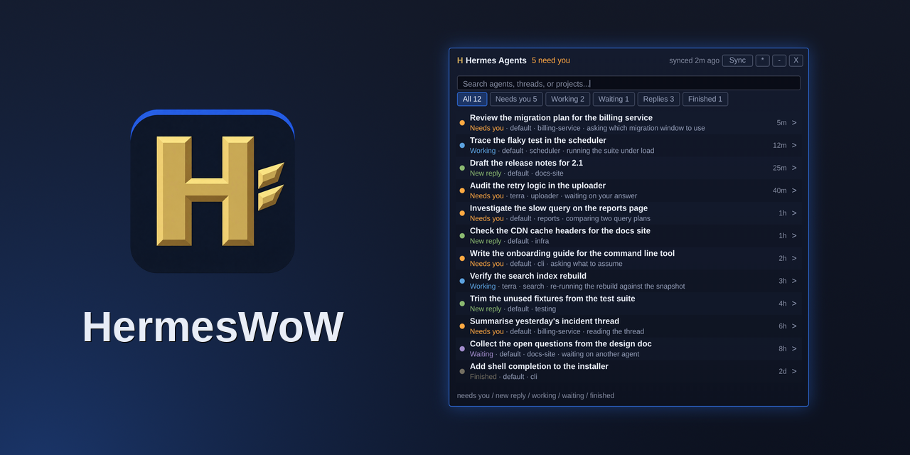

# hermes-wow

Hermes agents in Azeroth: a native in-game board for what needs you, plus the
out-of-game half that feeds it.



[Download 0.7.0 preview](https://github.com/btsouth/hermes-wow/releases/tag/v0.7.0)
· [In-game checklist](#what-has-been-tested-and-what-has-not)

See which agents need you, reply, mark messages read, or request a running turn
to stop without leaving the game. Status updates arrive when you sync.

**Requires an existing local Hermes installation and its session store.** The
addon zip alone cannot connect to agents. Run the Python bridge on the computer
with the game client; guided setup starts it in the background and at login.
Stop also requires the running Hermes desktop backend. Linux is the
tested bridge host; other operating systems are not verified.

The platform constraints that decide this design, and why an addon cannot be a
live monitor on its own: [docs/design/wow-mode.md](docs/design/wow-mode.md).

## What is in here

| Piece | Where | What it does |
| --- | --- | --- |
| Addon `HermesAI` | `addon/HermesAI/` | The product: badge, board, detail pane with a composer, settings, minimap button, keybinds. The game draws it in full screen; non-default UI scales still need in-game verification |
| Bridge | `wowmode/wowclient.py` | Publishes the roster into the addon's `Data.lua`, reads queued replies out of SavedVariables, dispatches them |
| Roster engine | `wowmode/roster.py` | Sessions, statuses, unread, live turns, straight from the session store |
| Replies | `wowmode/backend.py` | Desktop backend RPC (`session.resume` then `prompt.submit`), falling back to a detached `hermes chat --resume` turn |
| Remote hosts | `wowmode/hosts.py` | Merges agents from other machines over ssh, tagging each row with its host and keeping a down host's last known rows, labelled |
| Panel preview | `scripts/panel_preview.py` | Renders the panel into HTML, reading its palette out of the addon so it cannot drift: your live roster by default, `--demo` for a made-up one that is safe to put on a store page |
| Live pulse (optional, superseded) | `overlay/` | A 196x40 status badge outside the game. See `overlay/README.md`: the addon's own badge and minimap button replaced this |

The panel, rendered against a live roster, is generated by
`make preview` into `docs/panel-preview.html` (open it in a browser: it is a web
page, not an image).

## Install and setup

On Linux with a systemd user session, paste this into a terminal:

```bash
curl -fsSL https://raw.githubusercontent.com/btsouth/hermes-wow/v0.7.0/install.sh | bash
```

Requires an existing Hermes installation, Python 3.10+, Git, curl, and a WoW client.
The installer downloads this tagged release into `~/.local/share/hermes-wow/app`
and runs guided setup. It finds Hermes and the game client, asks when more than
one client is available, installs the addon, and starts the background bridge.
You do not need to keep a terminal open. The current addon interface pin is
16001 (Classic beta); other builds are not verified.

The command is installed at `~/.local/bin/hermes-wow`. If your shell cannot find
`hermes-wow`, use that full path. Re-run setup to repair the installation or
choose paths explicitly:

```bash
hermes-wow setup
hermes-wow setup --addon-dir "/path/to/World of Warcraft/_classic_beta_/Interface/AddOns" --hermes-home "$HOME/.hermes"
```

Setup asks before replacing an addon it does not own and saves a backup. If an
addon manager owns the folder, choose whether to switch ownership before setup
replaces it. `--force` authorizes backup and replacement for unattended setup.

Then restart the game client (a new addon folder is only scanned at startup),
and in game:

- click the badge, or type `/hermesai` (short form `/hai`), to open the board
- click a session, type a reply, `Enter` (it syncs by default: the reply goes
  out at the next bridge poll; sync again to see the result)
- `/hermesai sync` forces a refresh, `/hermesai status` prints the snapshot to
  chat, `/hermesai help` lists the rest
- keybinds live under **Key Bindings, AddOns, Hermes Agents**

`Sync` is a UI reload because that is the only moment the client reads
`Data.lua` and writes `SavedVariables`. It refuses while you are in combat.

## Update or uninstall

```bash
hermes-wow update
hermes-wow uninstall
```

For installer-managed installations, update selects the newest published version,
including previews, and updates the managed bridge and addon together. It reuses your selected paths, restarts the
bridge, and rolls back if installation fails. A modified checkout is preserved
and the update stops with an explanation. Source checkouts are updated with Git
instead. Reload the game UI after updating.

Uninstall stops and removes bridge autostart and the installed command. It keeps
your addon folder, SavedVariables, Hermes data, bridge runtime, settings and
backups. Remove the addon through your addon manager or game folder separately
if you also want it gone.

## If something is not connecting

```bash
hermes-wow setup                     # repair or finish setup
hermes-wow wow status                # show the selected game client
hermes-wow doctor                    # check Hermes and bridge dependencies
systemctl --user status hermes-wow.service
journalctl --user -u hermes-wow.service -n 40 --no-pager
```

- **No snapshot:** run setup on the game computer, then Sync in game.
- **Snapshot is old:** Sync first. If it stays old, run setup and check the service.
  An old snapshot alone cannot tell the addon whether the bridge has stopped.
- **Bridge version mismatch:** run `hermes-wow update`, then Sync. Manually
  installed addons must match their bridge version too.

## Manual installation and development

The release zip contains one top-level `HermesAI/` folder for addon managers or
manual installation. It still needs the bridge. For a source checkout:

```bash
git clone https://github.com/btsouth/hermes-wow.git
cd hermes-wow
./bin/hermes-wow setup
```

`make package` builds `dist/HermesAI-0.7.0.zip`. Low-level commands remain
available: `wow install`, `wow publish`, and `wow watch --interval 10`.
`HERMES_WOW_ADDON_DIR` overrides client detection for those commands. Avoid
running a second watcher while the managed background service is active.

## Terminal side

```bash
hermes-wow board                      # the triage list
hermes-wow reply <id> "text"          # answer a session from here
hermes-wow overlay --anchor other     # live badge on the non-game display
hermes-wow toggle                     # badge <-> board for that overlay
hermes-wow doctor                     # check every piece
```

## Statuses

Derived from the session store, not from a guess:

| Status | Meaning |
| --- | --- |
| `Needs you` | Unread, the last thing said was the agent's, and it is asking you something |
| `Error` | The session's end reason is an error, crash, timeout or failure |
| `Working` | A turn holds a live `session_turn_leases` row whose holder process is still alive |
| `New reply` | Unread output that is not a question |
| `Idle` / `Finished` | Nothing outstanding |

The lease check is what makes `Working` honest from a second process: the lease
alone would keep a crashed session blue forever, so the holder pid is checked
against `/proc`. Unread comes from `last_activity_at > last_read_at`, the
backend's own read watermark.

## Replies

`hermes-wow reply` uses the desktop backend when it is running:
`session.active_list` to find the stored session, `session.resume` if it is not
live, then `prompt.submit`. Stored ids and live ids differ (`20260918_184306_...
` versus a short runtime id) and `prompt.submit` only accepts the live one.

If no backend is up, or the RPC refuses, the reply falls back to a detached
`hermes chat -Q --resume <id> --oneshot -q <text>` turn: slower, about ten
seconds, but it needs nothing running.

## Read, stop, and notifications

- **Mark read** in the detail pane queues a bridge-side dismissal. Sync to send
  it. The bridge remembers the host, session, and activity timestamp; newer
  activity brings the session back. It never writes Hermes's session database.
- **Stop turn** appears for local working sessions. It queues until sync and
  interrupts only an already-active desktop session. It cannot start or resume
  one, and there is no CLI or remote-stop fallback. Backend failures are reported
  in the dispatch result. Interrupt also clears queued prompts and denies pending
  approvals. A delayed stop can reach a later turn in the same session, so use
  it only when you intend to interrupt that session's current work.
- After a sync, a small **toast** announces new attention or work that finished.
  Click it to open that session. First run is silent and repeated transitions
  have a cooldown. Settings has separate sound and Sync toasts toggles.
- Session links in addon chat open the corresponding detail pane.

Sync flushes queued actions to SavedVariables and reloads the UI. The bridge
processes that file on its next poll. The same reload may happen before the new
result is published; sync again to see delivery, dismissal, or stop results.
There is no live in-game feed.

## Other machines

The board can merge agents from more than one box. Each host is polled over ssh
by piping the *same* roster module the local bridge uses, so a remote row cannot
be bucketed differently from a local one, and nothing has to be installed on the
other end beyond python3 and a working key.

```
hermes-wow wow hosts add terra --ssh terra --hermes-home /home/bts/.hermes
hermes-wow wow hosts list
hermes-wow wow hosts test terra
hermes-wow wow hosts remove terra
hermes-wow wow publish --no-hosts      # local only, for one publish
```

Rules the merge keeps:

- a row from another machine says which machine; a local row says `local`
- a host that cannot be reached keeps its last known rows, marked `host offline`.
  A host going down must never look like work finishing.
- a dead host can never hold up the local publish: `publish` reads its cache and
  spends at most `--host-ttl` (default 120s) before refetching, and `watch`
  refreshes hosts on its own thread
- a reply to a remote row is routed back to that host over ssh, not into the
  local backend

## What has been tested, and what has not

The panel has been played on **one machine, one client build, one configuration:
1440p with the game's own `Use UI Scale` checkbox left off** (so the client's
default scale for the display). That last part is worth knowing rather than
burying, because this UI is *measured* rather than guessed; text is fitted with
`GetStringWidth` and the geometry is in pixels at a 1.0 scale; and a non-default
UI scale or a much smaller or larger display is the most likely place for a layout
problem to still be hiding. The gates are offline and structurally cannot see it:
they prove the logic, not the pixels.

**English only.** The locale indirection is real; `Locale.lua`, and the release
lint fails on a hard-coded user-facing string; but no translation files ship.

Not verified at all: multiple accounts, a fresh install with no historical
SavedVariables, other clients in the Classic family, and every addon that touches
the minimap at the same time.

## Development

```
make check        # every gate: no game client, no network
make preview      # render the panel against the live roster
make install      # copy the addon into the client and publish
```

Layout: `addon/HermesAI/` is five Lua files loaded in toc order (`Locale`, `Data`,
`Payload`, `Core`, `UI`); `wowmode/` is the bridge; `tests/` holds the gates;
`docs/design/` holds the reasoning.

Also worth knowing:

| Target | What it is for |
| --- | --- |
| `make package` | the release zip, into `dist/` |
| `make icon MASTER=…` | turns generated art into the shipped `icon.tga` and wires the toc; see `docs/design/icon-art.md` for the palette and the prompts |
| `make banner` | composes the store-page banner from the emblem, the addon's own panel rendered against a made-up roster, and a real-font wordmark |
| `make interface IFACE=…` | moves the interface pin to a new client build, in both places it is written down |
| `make preview` | the same panel renderer, against your live roster, into `docs/panel-preview.html` |

The gates exist because the two failure modes that matter here are both offline:
a Lua API the client rejects, and a payload format the two halves disagree about.

| Gate | Catches |
| --- | --- |
| `tests/wow_stub.lua` | the addon under a strict stub client: template-gated methods, font names, every UI path, the outbox wire format |
| `tests/roster_test.py` | the status engine: every bucket, the attention count, leases, a hidden session, a store missing columns |
| `tests/roundtrip.py` | bridge to file to addon and back: hostile titles, torn payloads, host routing, control messages, legacy wire shapes, a lost dispatch log |
| `tests/hostile_test.py` | a corpus of junk the two halves must survive: torn payloads, junk ids, unreadable SavedVariables, a megabyte outbox, 200 fuzzed strings |
| `tests/hosts_test.py` | remote hosts: merging, a host going down, reply routing |
| `tests/addon_checks.py` | release lint: toc/file agreement, schema agreement across both halves, status and kind vocabularies, localization, forbidden APIs |
| `tests/notify_test.py` | transitions, cooldowns, dry runs |

Two rules for changes here:

1. **A new status, kind or payload field is a change in two languages.** Add it to
   `roster.py` or `wowclient.py`, then to the Lua, then assert it in a gate; the
   lint fails if the two vocabularies disagree rather than letting a row render
   blank in game.
2. **Verify the look, not only the logic.** A stub proves the code runs and says
   nothing about whether the panel is legible. `make preview` renders it; look at
   it before claiming a UI change is done.

Localization: user-visible text goes through `L[...]` in `Locale.lua`, where a
missing translation is its own label, so a new language is one file and English
needs none.

## Known limits

* In game the board shows the snapshot from the last UI load, because the client
  only reads addon files at load. Press Sync (or let a zone change do it) when
  you want it current.
* A session blocked on an approval prompt reads as `Working`, not `Needs you`.
  Approval waits only exist inside the owning process; they are not in the
  store, and attaching a second client to that process risks taking the desktop
  app's stream away from it.
* The live badge, when you run it, sits outside the game by definition. On a
  compositor where full screen is exclusive, nothing in user space draws over
  the game, which is why the in-game half is an addon at all.
* One overlay at a time, enforced by an Electron single instance lock.
* `Hand off` puts a session id on the clipboard and raises a notification. Hermes
  has no outside API to focus a session in the desktop app, so that is the honest
  maximum; anything more would be a lie in the UI.
* Remote hosts need working ssh keys and `python3` on the other side. The bridge
  pipes its own roster module over ssh rather than installing anything there.
* Renaming the addon folder needs a full client restart. `/reload` re-reads the
  Lua of an addon that has already loaded; it does not rescan the AddOns folder.
* Nothing here has been seen on a live server yet. The gates and the preview cover
  logic and layout; frame strata against other addons, fonts at an unfamiliar UI
  scale, and the minimap button's neighbours need a human in game.
